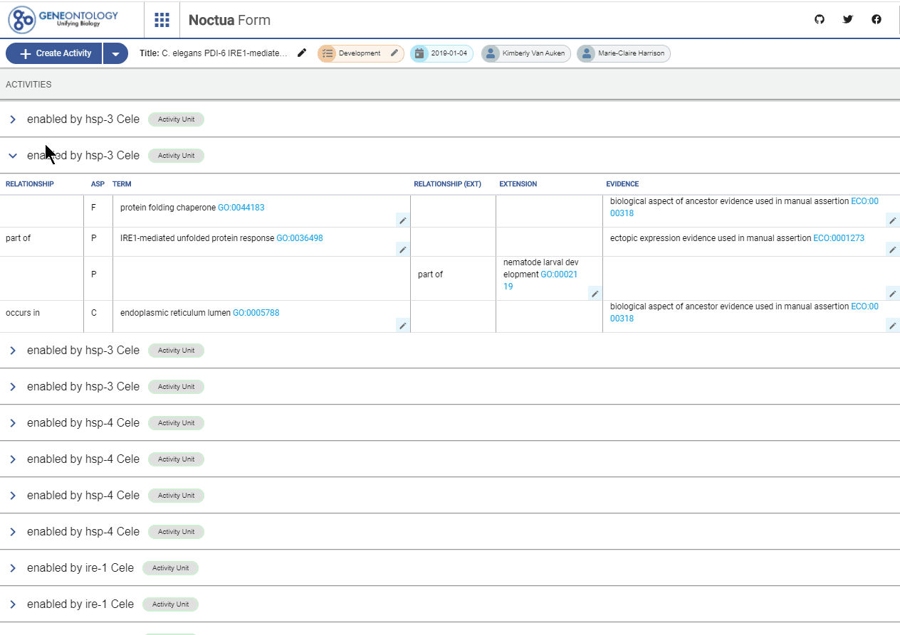

# Changelog - 09-02-2020 - Dev PR

This is for PR https://github.com/geneontology/noctua-form/pull/115

---

## Added

- Potential Fix for reusing values in the model https://github.com/geneontology/noctua-form/issues/99

## Changed

- Now using roottypes instead of closure 20 times faster (no kidding) biggest Reactome model loads in few seconds after receiving the minerva response thanks @goodb 
- Login issues https://github.com/geneontology/noctua-form/issues/114

## Test Cases

- [ ] Quickly validate if the table is displaying well (in case roottypes glitches)
- [ ] Check if the each term field is displaying correct ontology class on pre-autocomplete. BP should have only BP terms
- [ ] Check if you start typing, the autocomplete will work as before
- [ ] Repeat for Evidence
- [ ] Reference and With will filter as you type
- [ ] Check if creating basic model work. Check BP Only and CC Only just in case

## Details

### Pre-autocomplete

When a box is clicked (before typing) a selectable list of autocomplete present in the model are shown

- Term Field: Distinct ontology terms filtered by ontology class
- Evidence: Distinct evidence in the model
- Reference: Distinct reference string in the model
- With Field: Distinct "with" string in the model

